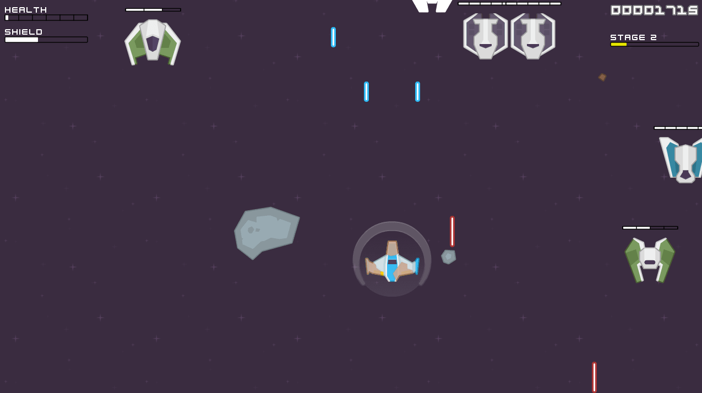

# Space-Love
A space shooter written with [LÖVE❤](https://love2d.org/) (version 0.10.2) in Lua.

## Download
Download the latest version of the game via the [Releases](https://github.com/RafaelWO/space-love/releases). 

For Windows (win32, win64) and MacOS users, please download the corresponding `.zip` file. To run the game on Linux you have to install LÖVE 0.10.2 - via the [download page](https://love2d.org/#download) or directly via the corresponding [GitHub release](https://github.com/love2d/love/releases/tag/0.10.2) - and then download the `.love` file which can be run afterwards (see also [Game Distribution](https://love2d.org/wiki/Game_Distribution) chapter "Distribution for Linux").

## Instructions
#### Menu
Use the arrow keys <kbd>&uarr;</kbd> <kbd>&darr;</kbd> to navigate within menus and press <kbd>enter</kbd> to select.

#### In-Game
Use the arrow keys <kbd>&larr;</kbd> <kbd>&uarr;</kbd> <kbd>&rarr;</kbd> <kbd>&darr;</kbd> to navigate your ship. Press/Hold <kbd>space</kbd> to shoot.

Press <kbd>p</kbd> to pause the game.

Press <kbd>esc</kbd> to quit.

## Used Libraries, Art Packs, Sounds
### Art Pack
The sprites (plus backgrounds, fonts and some sound effects) used in this game are from the art pack [Space Shooter Redux](https://opengameart.org/content/space-shooter-redux) by [Kenny](www.kenney.nl).

### Sounds
The soundtracks are from Juhani Junkala and can be found [here](https://opengameart.org/content/5-chiptunes-action).

Other sound effects:
- Various sounds from [512 Sound Effects](https://opengameart.org/content/512-sound-effects-8-bit-style)
- [Explosion](https://opengameart.org/content/explosion-0)

### Libraries
 * [Class](https://github.com/vrld/hump)
 * [Push](https://github.com/Ulydev/push)
 * [Knife](https://github.com/airstruck/knife)
 * [XmlParser](https://github.com/jonathanpoelen/xmlparser)